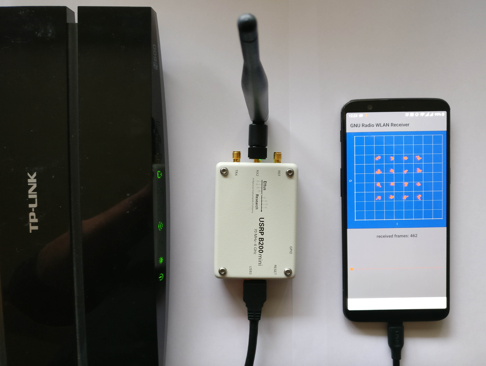

# GNU Radio Android WLAN Receiver

This is a demo application for the GNU Radio on Android toolchain, implementing a WLAN receiver.
It is based on the [gr-ieee802-11](https://github.com/bastibl/gr-ieee802-11/) GNU Radio module.

## Installation

Building the app requires the [GNU Radio Android toolchain](https://github.com/bastibl/gnuradio-android/). Please see this repository for further instructions.

## Running the App

Parameters like sample rate, center frequency, and gain are hard-coded for now. Please adapt `native-lib.cpp` accordingly.

## Publication

If you use this project, we would appreciate a reference to:

<ul>
<li>
 <a class="bibauthorlink" href="https://www.bastibl.net/">Bastian Bloessl</a>, Lars Baumgärtner and Matthias Hollick, “<strong>Hardware-Accelerated Real-Time Stream Data Processing on Android with GNU Radio</strong>,” Proceedings of 14th International Workshop on Wireless Network Testbeds, Experimental evaluation &amp; Characterization (WiNTECH’20), London, UK, September 2020.
 <small>[<a href="http://dx.doi.org/10.1145/3411276.3412184">DOI</a>, <a href="https://www.bastibl.net/bib/bloessl2020hardware/bloessl2020hardware.bib">BibTeX</a>, <a href="https://www.bastibl.net/bib/bloessl2020hardware/">PDF and Details…</a>]</small>

</li>
</ul>
